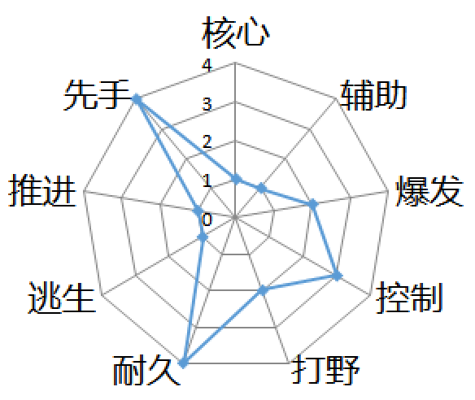
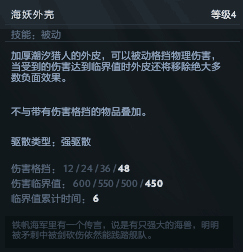
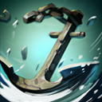

<h2>潮汐猎人（简称：潮汐，英文简称：TH，外号：西瓜皮）</h2>

 

<h3>属性（裸装）：</h3> 

    

    
        等级:<select id="level">
                <option value="1" selected>1级</option>
                <option value="2">2级</option>
                <option value="3">3级</option>
                <option value="4">4级</option>
                <option value="5">5级</option>
                <option value="6">6级</option>
                <option value="7">7级</option>
                <option value="8">8级</option>
                <option value="9">9级</option>
                <option value="10">10级</option>
                <option value="11">11级</option>
                <option value="12">12级</option>
                <option value="13">13级</option>
                <option value="14">14级</option>
                <option value="15">15级</option>
                <option value="16">16级</option>
                <option value="17">17级</option>
                <option value="18">18级</option>
                <option value="19">19级</option>
                <option value="20">20级</option>
                <option value="21">21级</option>
                <option value="22">22级</option>
                <option value="23">23级</option>
                <option value="24">24级</option>
                <option value="25">25级</option>
            </select> 
        力量:
        敏捷:
        智力:
    
    

    <table border="1" cellpadding="3" cellspacing="1" style="width:100%">

        <tbody>

        <tr>
            <td>气血</td>
            <td>魔法</td>
            <td>攻击力</td>
            <td>攻击距离</td>
        </tr>
        
        <tr>
            <td></td>
            <td></td>
            <td></td>
            <td></td>
        </tr>

        <tr>
            <td>攻速</td>
            <td>移速</td>
            <td>护甲</td>
            <td>魔法抗性</td>
        </tr>
        
        <tr>
            <td></td>
            <td></td>
            <td></td>
            <td>%</td>
        </tr>

        <tr>
            <td>技能增强</td>
            <td>生命恢复</td>
            <td>魔法恢复</td>
            <td class="state_resistance" hidden>状态抗性</td>
        </tr>
        
        <tr>
            <td>%</td>
            <td>%</td>
            <td>%</td>
            <td class="state_resistance" hidden>%</td>
        </tr>

        </tbody>
    </table>

 

 

<h3>定位：</h3>

    

 

    
tips：潮汐猎人一般为三号位抗压。力量英雄加上被动减伤，是一个不俗的肉盾。大招又是大范围眩晕，是一个少有的大控英雄。

 

 

    
<h3>技能介绍：</h3>

    
一技能：巨浪

    
 

    

        
    

 

tips：

    
1、该技能可用阿哈利姆神杖升级技能威力。巨浪变成点地施放的波形技能，可以作用于直线上的单位。减少冷却时间。

    
神杖升级距离：1800

    
神杖升级作用范围：240

    
神杖升级冷却时间：7秒

    
 

    <!-- 

 -->
     
     

二技能：海妖外壳

 

    

    
如果6秒内没有受到来自玩家的伤害，伤害累计值将重置。

    
海妖外壳能移除绝大多数负面状态，即使该状态效果无法驱散。

 

tips：

1、带有伤害格挡的物品有：圆盾、先锋盾、赤红甲、大晕锤（深渊之刃）。“不与带有伤害格挡的物品叠加”，所以潮汐不推荐出圆盾、先锋盾、赤红甲、大晕锤（深渊之刃）。

2、7.07版本穷鬼盾的移除，导致劣势路英雄的对线能力被削弱。但是对于拥有海妖外壳的潮汐而言，对线并没受到太大影响。

3、海妖外壳伤害达到临界值时能移除像眩晕、沉默、减速等debuff。

<!-- 
图中为解除血棘沉默时的效果。
 -->
<!-- 

 -->

 

 

三技能：锚击

 

    

 

tips：

1、因为“无视技能免疫：是”，所以锚击可以对魔免状态下的单位降低攻击力。&nbsp;因为 “伤害类型：物理”，所以锚击可以对魔免状态下的单位造成伤害。两个属性组合在一起，所以锚击可以对魔免状态下的单位造成伤害并且降低攻击力。

2、“伤害类型：物理”，所以实际造成的伤害计算的是敌方单位的“物理抗性”，敌方护甲越高，锚击造成伤害越低，所以配合一技能巨浪的减甲，效果更佳。

3、锚击的减伤 配合 海妖外壳的格挡，可以帮助潮汐“无伤”打野：

1）2外壳+3锚击 或者 3外壳+2锚击，所有普通野怪在被锚击减伤后，无法对潮汐造成伤害。

2）3外壳+3锚击，远古黑龙、远古雷肤兽在被锚击减伤后，无法对潮汐造成伤害。

3）4外壳+3锚击 或者 3外壳+4锚击，远古花岗石傀儡在被锚击减伤后，无法对潮汐造成伤害。

4）远古萨满潜行者，潮汐前期打不过。

 

四技能：毁灭

 

    

 

tips：

1、大秘刷秘大是出了刷新球之后的必备口诀。如果只是大刷大，耗蓝为325+375+325=1025。而使用口诀之后，耗蓝为325-135+375-135+325=755。如果为卫士胫甲的话，耗蓝为325-160+375-160+325=705。

<!-- 
 
 -->
<!-- 如图所示，大刷大的潮汐放完两个大后就空蓝了，使用大秘刷秘大口诀的潮汐结束还有三分之一所有的蓝，还能继续放其他技能。 -->

 

 

    
<h3>技能加点：</h3>

    
建议一：前期发育很不顺，需要15级点经验天赋帮助自己提升等级

    

     
    
建议二：对面物理输出英雄多，加大减伤削弱对面输出

    

 

 

<h3>天赋：</h3>

    
10级：左边增加一技能伤害，右边增加移动速度，建议加左边。

    
15级：前期发育很不顺时，建议加右边，其他时候建议加左边。

    
20级：左边增加一技能的护甲削弱，右边使自己更肉，建议加右边。

    
25级：左边相当于自带圣剑，但作为主打控制的三号位英雄，建议加右边，减少技能冷却时间。

 

 

<h3>出装选择：</h3>

出门：树之祭祀、治疗药膏、魔法芒果、铁树枝干*2、守护指环、侦查守卫（辅助提供）

    &nbsp;
    &nbsp;
    &nbsp;
    &nbsp;
    &nbsp;
    

 

前期：魔杖、奥术鞋、恢复头巾/治疗指环/王者之戒

    &nbsp;
    &nbsp;
    &nbsp;
    &nbsp;
    

 

中期：魔杖、奥术鞋、梅肯斯姆/挑战头巾，闪烁匕首

    &nbsp;
    &nbsp;
    &nbsp;
    &nbsp;
    

 

后期：卫士胫甲、洞察烟斗、希瓦的守护、闪烁匕首、刷新球、玲珑心、恐鳌之心、辉耀

    &nbsp;
    &nbsp;
    &nbsp;
    &nbsp;
    &nbsp;
    &nbsp;
    &nbsp;
    

 

 

<h3>打法：</h3>

前期凭借外壳和锚击减伤，可以试试强混劣势路。

如果劣势路实在混不了，就转战野区。

中期有大招就跟随队友一起推进。

后期团战，没有跳刀的潮汐就站在队伍的最前排做肉盾（但是潮汐后期跳刀为必备道具），有跳刀的潮汐可以躲在阴影处找准机会给与对面一击毁灭性的跳大。

 

