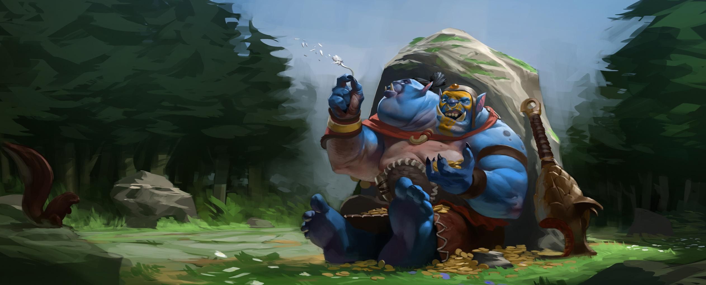
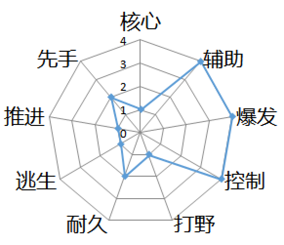
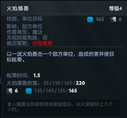
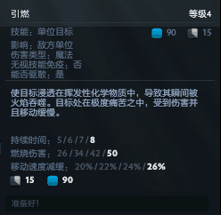
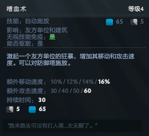
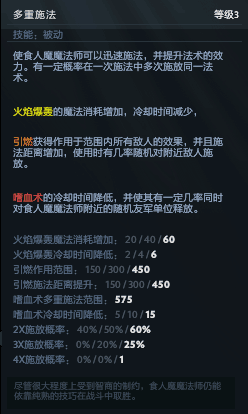
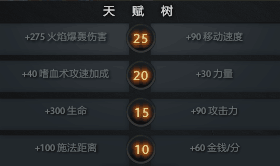

<h2>食人魔法师（简称：蓝胖，英文简称：OM）</h2>

 

<h3>属性（裸装）：</h3> 

    

    
        等级:<select id="level">
                <option value="1" selected>1级</option>
                <option value="2">2级</option>
                <option value="3">3级</option>
                <option value="4">4级</option>
                <option value="5">5级</option>
                <option value="6">6级</option>
                <option value="7">7级</option>
                <option value="8">8级</option>
                <option value="9">9级</option>
                <option value="10">10级</option>
                <option value="11">11级</option>
                <option value="12">12级</option>
                <option value="13">13级</option>
                <option value="14">14级</option>
                <option value="15">15级</option>
                <option value="16">16级</option>
                <option value="17">17级</option>
                <option value="18">18级</option>
                <option value="19">19级</option>
                <option value="20">20级</option>
                <option value="21">21级</option>
                <option value="22">22级</option>
                <option value="23">23级</option>
                <option value="24">24级</option>
                <option value="25">25级</option>
            </select> 
        力量:
        敏捷:
        智力:
    
    

    <table border="1" cellpadding="3" cellspacing="1" style="width:100%">

        <tbody>

        <tr>
            <td>气血</td>
            <td>魔法</td>
            <td>攻击力</td>
            <td>攻击距离</td>
        </tr>
        
        <tr>
            <td></td>
            <td></td>
            <td></td>
            <td></td>
        </tr>

        <tr>
            <td>攻速</td>
            <td>移速</td>
            <td>护甲</td>
            <td>魔法抗性</td>
        </tr>
        
        <tr>
            <td></td>
            <td></td>
            <td></td>
            <td>%</td>
        </tr>

        <tr>
            <td>技能增强</td>
            <td>生命恢复</td>
            <td>魔法恢复</td>
            <td class="state_resistance">状态抗性</td>
        </tr>
        
        <tr>
            <td>%</td>
            <td>%</td>
            <td>%</td>
            <td class="state_resistance">%</td>
        </tr>

        </tbody>
    </table>

 

 

<h3>定位：</h3>

    

 

 

    
<h3>技能介绍：</h3>

    
一技能：火焰爆轰

    
 

    

        
    

 

tips：

    

 

 

二技能：引燃

 

    

 

tips：

 

 

三技能：嗜血术

 

    

 

tips：

 

 

四技能：毁灭

 

    

 

tips：

 

 

<h3>天赋：</h3>

 

 

    
<h3>技能天赋加点：</h3>

    

     

 

 

<h3>出装选择：</h3>

出门：树之祭祀、治疗药膏、魔法芒果、铁树枝干、铁树枝干、守护指环、侦查守卫（辅助提供）

&nbsp;&nbsp;&nbsp;&nbsp;&nbsp;&nbsp;

 

前期：魔杖、奥术鞋、恢复头巾/治疗指环/王者之戒

&nbsp;&nbsp;&nbsp;&nbsp;

 

中期：魔杖、奥术鞋、梅肯斯姆/挑战头巾，闪烁匕首

&nbsp;&nbsp;&nbsp;&nbsp; 

后期：卫士胫甲、洞察烟斗、希瓦的守护、闪烁匕首、刷新球、玲珑心、恐鳌之心、辉耀

&nbsp;&nbsp;&nbsp;&nbsp;&nbsp;&nbsp;&nbsp;

 

 

<h3>打法：</h3>

 

